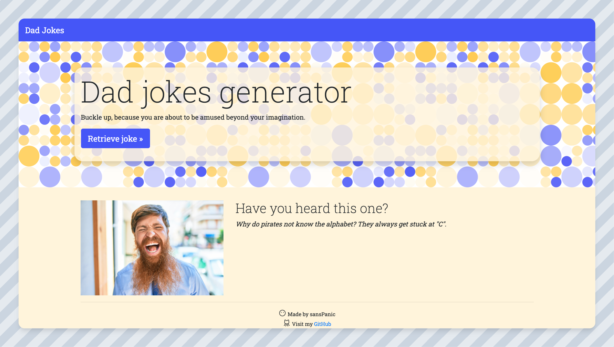

# DAD JOKES GENERATOR

### :older_adult: Retrieval of dad jokes from external API

This is a small personal project, intended for practice only.

### Features: 

* Retrieval of random dad joke from external API

### Concepts practiced: 

1. Vanilla JS DOM Manipulation
2. API calls with Axios
3. Reading & understanding external API documentation
4. Bootstrap

# SCREENSHOT

# Credits 

1. Icons by [phosphor](https://phosphoricons.com/)
2. Patterns by [Patternpad](https://patternpad.com/)
3. Random men from [Unsplash](https://unsplash.com/)
